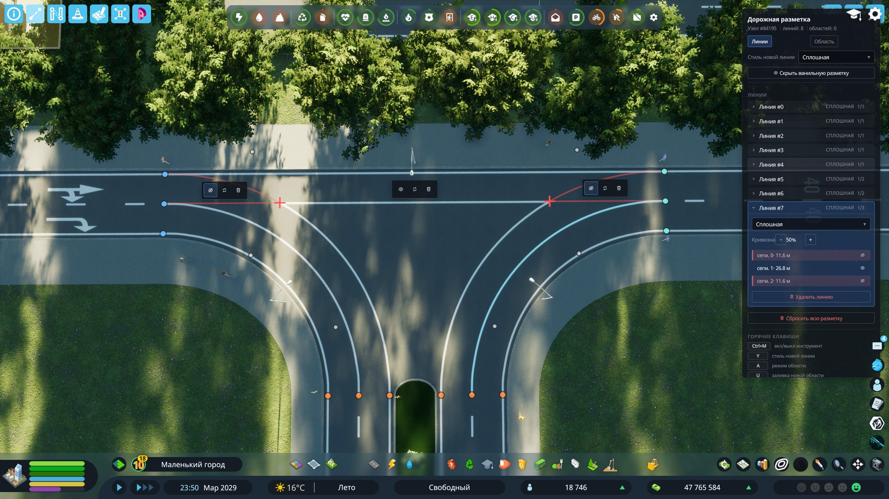
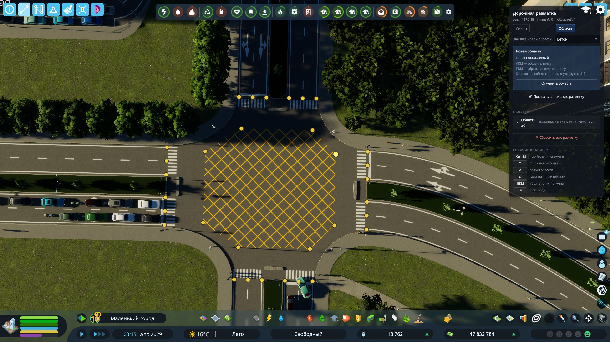
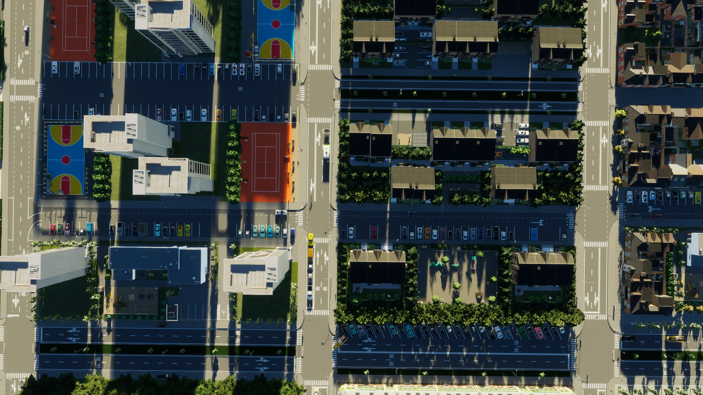

# Town Road Lane — Road Markings

A road-marking mod for **Cities: Skylines II**: a manual marking editor for intersections plus automatic edge/parking lane markings for ordinary town roads.



## Features

### Marking editor
Click any intersection and draw your own markings:

- **Lines** between lane endpoint dots — Solid, Dashed, Double Solid, and G87 line styles, with adjustable curvature and per-segment visibility.
- **Area fills** over any polygon you outline — junction box (yellow box), white/yellow hatching, green bike lane, red bus lane, concrete.
- **Hide vanilla markings** per intersection to start from a clean slate.
- In-game panel (English + Russian) and hotkeys: `Ctrl+M` toggle tool, `Y` cycle line style, `A` area mode, `U` cycle area fill.



### Automatic markings
Ordinary city roads with 3 m lanes get proper edge lane markings — the same way highways do — so parking, sidewalks and stops react correctly. Parking lane markings included.



## Known limitations

- **The mod is purely visual.** Markings never affect how vehicles actually drive. To change real lane behavior use [Traffic](https://github.com/krzychu124/Traffic) — set up lane connections and directions there first, then draw your markings to match. The two mods don't sync automatically.
- **Very sharp contact angles** between marking lines (a few degrees) can still produce glitchy fills or slightly misplaced points.
- **Non-standard intersections** with strongly stretched connections (e.g. reshaped with Node Controller) can misplace the anchor dots. A fix is planned.
- **Move It:** after moving or reshaping a road, line markings adapt to the new geometry, but area fills may not — delete and redraw them.

## Dependencies

Line styles and area fills come from the G87 marking packs (installed automatically as PDX Mods dependencies):

- [G87] Road Markings (id 97828)
- [G87] Road Markings: Stripes and Chevrons (id 98624)

## Building

Requires the official CS2 modding toolchain (`CSII_TOOLPATH` set up by the game's mod project wizard) and Node.js for the UI bundle.

```powershell
cd src/TownRoadLaneUI
npm install          # once
cd ..
dotnet build src/TownRoadLane/TownRoadLane.csproj
```

The build compiles the C# systems, bundles the React UI via webpack, and deploys everything to the local `Mods/TownRoadLane` folder.

## Project layout

- `src/TownRoadLane/` — C# mod: ECS systems for marking topology, emission, rendering, and the in-game tool.
- `src/TownRoadLaneUI/` — React (cohtml) UI: tool panel, toolbar button, localization.

## Credits

- **G87** — the marking prefab packs this mod builds its styles on.
- Author: **mxerf**

## License

[GPL-3.0](LICENSE)
