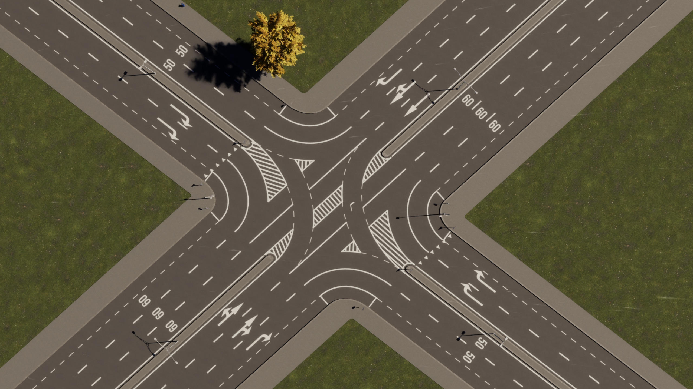
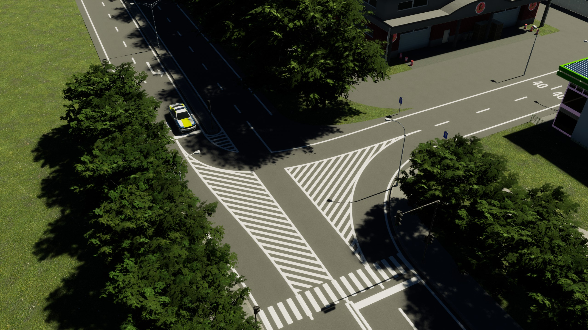
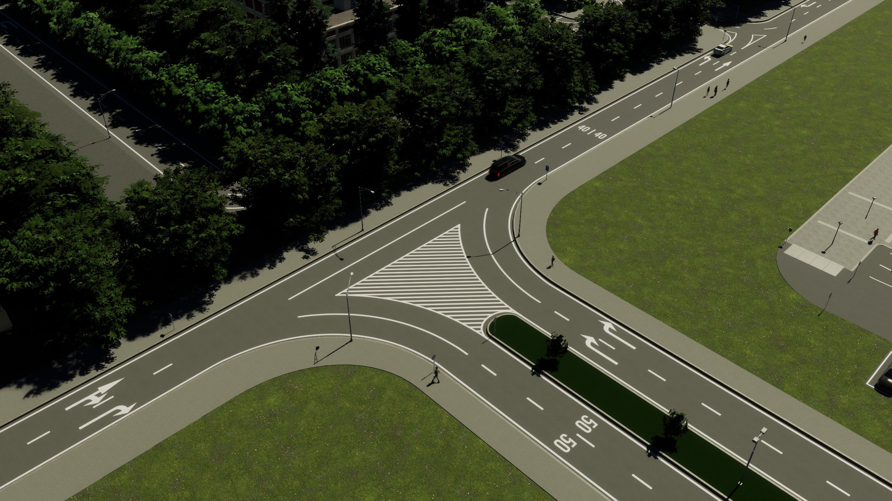
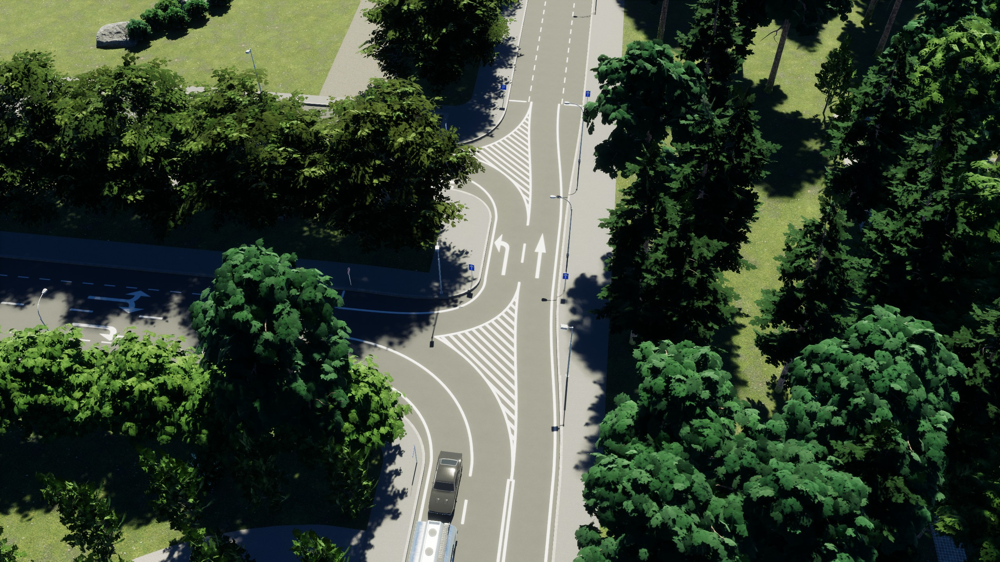

# Town Road Lane — дорожная разметка

[English](README.md) | **Русский**

[](https://mods.paradoxplaza.com/mods/150863/Windows)
[](https://mods.paradoxplaza.com/mods/150863/Windows)
[](https://mods.paradoxplaza.com/mods/150863/Windows)
[](https://mods.paradoxplaza.com/mods/150863/Windows)

Мод дорожной разметки для **Cities: Skylines II**: ручной редактор разметки перекрёстков плюс автоматическая краевая и парковочная разметка обычных городских дорог.



## Возможности

### Редактор разметки
Кликните по любому перекрёстку и нарисуйте свою разметку:

- **Линии** между точками-якорями — сплошная, пунктир (короткий / обычный / длинный), двойная сплошная, белые и жёлтые стили G87, бордюр (нужен бесплатный мод «[G87] Vanilla Curb»); настраиваемая кривизна и видимость отдельных сегментов.
- **Точки-якоря везде, где нужны** — на каждой границе полос, на краю проезжей части (в том числе за парковочными полосами) и вторым рядом за 8 м до перекрёстка — для сплошной перед стоп-линией, запрещающей перестроение.
- **Заливки областей** по обведённому полигону — вафельная разметка, белая и жёлтая штриховка, зелёная велополоса, красная автобусная полоса, бетон, трава, песок, тротуарная плитка, плитка, асфальтовая заплатка.
- **Скрытие ванильной разметки** на отдельном перекрёстке, чтобы начать с чистого листа.
- **Пины любимых стилей** — звёздочка в любом дропдауне стилей закрепляет стиль наверху всех списков.
- Панель в игре (английский + русский) и горячие клавиши: `Ctrl+M` — инструмент, `Y` — стиль линии, `A` — режим области, `U` — заливка области.






### Автоматическая разметка
Обычные городские дороги с полосами 3 м получают краевую разметку — как на шоссе, — поэтому парковка, тротуары и остановки работают корректно. Разметка парковочных полос включена.




## Известные ограничения

- **Мод чисто визуальный.** Разметка не влияет на реальное движение машин. Управлять полосами нужно модом [Traffic](https://github.com/krzychu124/Traffic): сначала настройте там направления и соединения полос, затем нарисуйте разметку под них. Автоматической синхронизации между модами нет.
- **Всё цепляется к точкам-якорям — намеренно.** Точки стоят на реальной геометрии дороги (границы полос, край проезжей части, углы бордюров, пересечения линий, плюс ряд за 8 м до перекрёстка) — поэтому разметка ложится точно по полосам за несколько кликов. Свободного размещения нет: для полностью ручного рисования ставьте декали и нет-лейны паков G87 вручную — этот мод поверх них как слой «быстро и точно» для перекрёстков.
- **Почти касательные контакты линий** (заметно меньше ~8°) считаются скольжением, а не пересечением — точка-якорь в таком месте не появляется (намеренно: защита от дрожащих дублей-якорей).
- **Вытянутые соединения** — съезды и слияния шоссе и другие узлы, где граница «дорога/перекрёсток» не перпендикулярна дороге, — могут смещать точки-якоря относительно краски: линии обрываются перпендикулярно своей полосе, а точки стоят на скошенной границе. Лечение: нормализуйте перекрёсток модом **Node Controller**, чтобы поперечные линии соединений стали перпендикулярны дороге (настоятельно рекомендуется). Второй ряд точек за 8 м до перекрёстка тоже остаётся пригодным.
- **Рёбра заливок** изгибаются вдоль линии, только если линия нарисована этим модом. Ванильную разметку заливка не огибает — вдоль неё ребро остаётся прямым отрезком между точками.
- **Move It:** после перемещения или изменения дороги линии подстраиваются под новую геометрию, а заливки областей — не всегда: удалите их и нарисуйте заново.

## Рост подписчиков

<picture>
  <source media="(prefers-color-scheme: dark)" srcset="https://raw.githubusercontent.com/mxerf/town-road-lane/stats/chart-dark.svg">
  
</picture>

Снимается каждые 6 часов из публичного API PDX Mods в ветку [`stats`](https://github.com/mxerf/town-road-lane/tree/stats).

## Зависимости

Стили линий и заливки берутся из паков разметки G87 (ставятся автоматически как зависимости PDX Mods):

- [G87] Road Markings (id 97828)
- [G87] Road Markings: Stripes and Chevrons (id 98624)

Опционально: заливка **«Асфальт»** использует отдельный мод «G87 Vanilla Asphalt Pavement» — без него она откатывается к бетону.

## Сборка

Нужны официальный тулчейн моддинга CS2 (`CSII_TOOLPATH` настраивается визардом мод-проекта игры) и Node.js для UI-бандла.

```powershell
cd src/TownRoadLaneUI
npm install          # один раз
cd ..
dotnet build src/TownRoadLane/TownRoadLane.csproj
```

Сборка компилирует C#-системы, собирает React-UI через webpack и раскладывает всё в локальную папку `Mods/TownRoadLane`.

## Структура проекта

- `src/TownRoadLane/` — C#-мод: ECS-системы топологии разметки, эмиссии, рендера и игровой инструмент.
- `src/TownRoadLaneUI/` — React (cohtml) UI: панель инструмента, кнопка тулбара, локализация.

## Благодарности

- **G87** — паки префабов разметки, на которых построены стили мода.
- Автор: **mxerf**

## Лицензия

[GPL-3.0](LICENSE)
